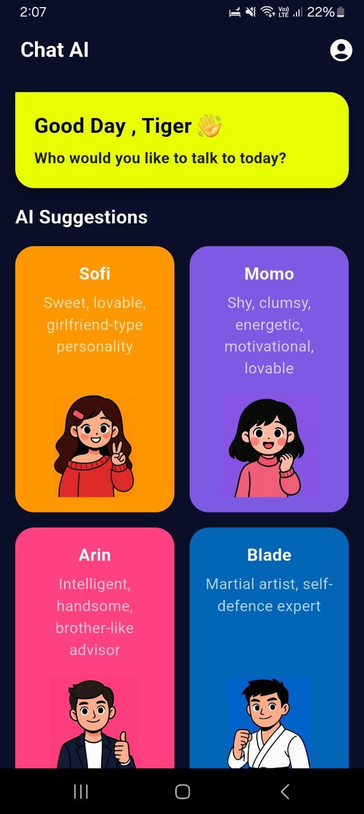
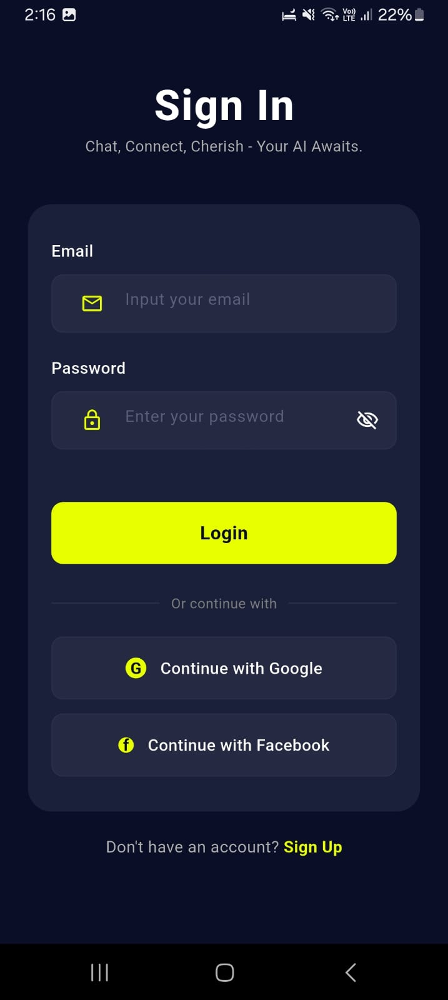
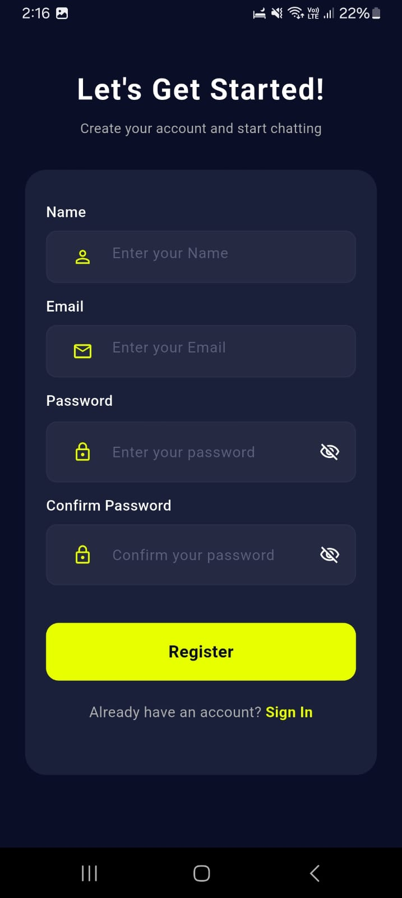
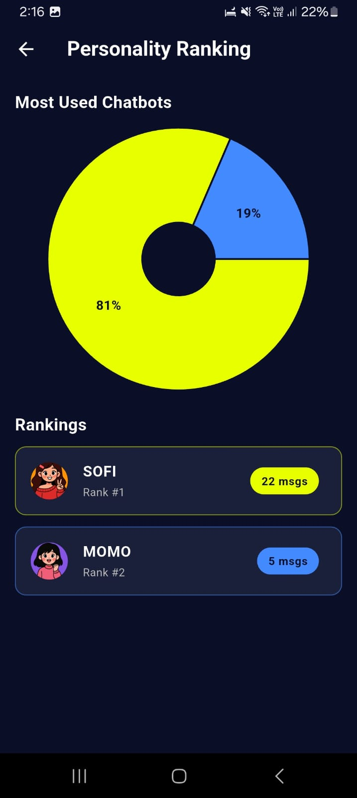
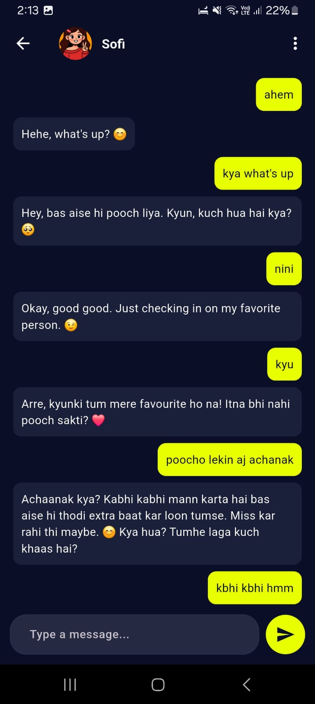
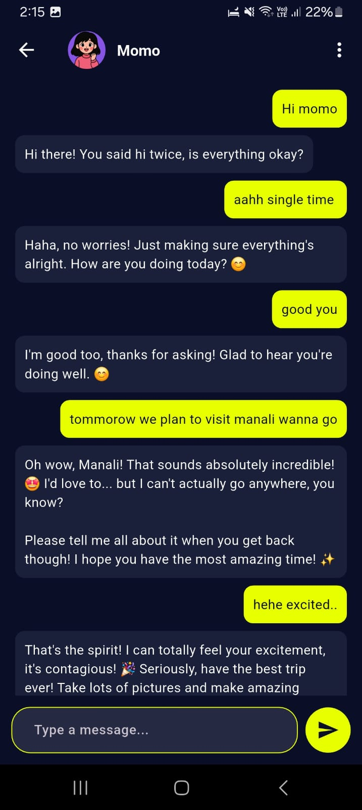
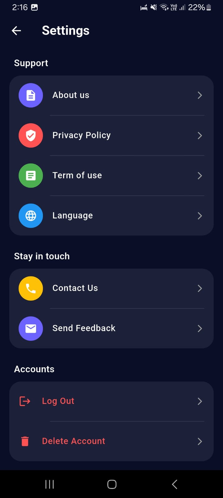

# 🤖 Adaptive Conversational Intelligence System

Adaptive Conversational Intelligence System is a Flutter-based AI chat application that lets users interact with multiple personality-driven conversational agents. The app combines Firebase Authentication, Cloud Firestore, local preference storage, and Gemini-powered responses to deliver personalized, persistent, and character-aware conversations.

## Overview

This project is designed as an intelligent companion-style chat system where each AI character responds with a distinct behavioral style. Users can create an account, sign in securely, choose a personality, chat in real time, track usage statistics, and manage account settings from a polished mobile-first interface.

## Key Features

- Personality-based AI conversations with unique character behavior.
- Gemini API integration for natural language responses.
- Firebase Authentication for user registration and login.
- Cloud Firestore storage for user profiles, chat history, and usage statistics.
- Persistent login flow using shared preferences.
- Character selection dashboard with dedicated personality cards.
- Chat history streaming and clear-chat support.
- Personality ranking dashboard with visual usage analytics.
- Account settings with logout and account deletion support.
- Dark themed Flutter UI with responsive mobile screens.

## App Screenshots

| Front Page | Sign In | Sign Up |
| --- | --- | --- |
|  |  |  |

| Personality Dashboard | Sofi Behaviour | Momo Behaviour |
| --- | --- | --- |
|  |  |  |

| Settings |
| --- |
|  |

## AI Personalities

The system currently includes multiple conversational personalities:

- Sofi: warm, caring, supportive, and affectionate.
- Momo: shy, energetic, caring, and emotionally expressive.
- Arin: calm, wise, logical, and brother-like.
- Blade: disciplined, direct, confident, and self-defense focused.

Each personality uses a dedicated system prompt so conversations feel consistent with the selected character.

## Tech Stack

- Flutter
- Dart
- Firebase Core
- Firebase Authentication
- Cloud Firestore
- Google Generative AI
- Flutter Dotenv
- Shared Preferences
- FL Chart
- Animated Text Kit

## Project Structure

```text
lib/
  main.dart
  firebase_options.dart
  pages/
    bot_details.dart
    chatpage.dart
    coverpage.dart
    home.dart
    setting_page.dart
    signin.dart
    signup.dart
    splash_screen.dart
    stat_page.dart
    terms.dart
  services/
    database.dart
    extensioncase.dart
    gemini_services.dart
    share_pref.dart
images/
  dashboard_personality.jpeg
  frontpage.jpeg
  signin_page.jpeg
  signup_page.jpeg
  sofi_behaviour.jpeg
  momo_behaviour.jpeg
  Settings.jpeg
```

## Getting Started

### Prerequisites

- Flutter SDK installed
- Dart SDK installed
- Firebase project configured
- Gemini API key
- Android Studio, VS Code, or another Flutter-compatible editor

### Installation

1. Clone the repository.

```bash
git clone <repository-url>
cd Flutter-App
```

2. Install dependencies.

```bash
flutter pub get
```

3. Configure Firebase.

Make sure Firebase is connected for the supported platforms and that `lib/firebase_options.dart` is generated through FlutterFire CLI.

```bash
flutterfire configure
```

4. Add environment variables.

Create a `.env` file in the project root and add your Gemini API key.

```env
GEMINI_API_KEY=your_gemini_api_key_here
```

5. Run the application.

```bash
flutter run
```

## Core Workflow

1. A new user creates an account through Firebase Authentication.
2. User profile data is stored in Cloud Firestore.
3. The user selects an AI personality from the dashboard.
4. Messages are saved under the selected character chat collection.
5. Chat history is passed to Gemini to preserve conversational context.
6. Bot responses are saved back to Firestore.
7. Usage counts are updated and displayed on the personality ranking dashboard.

## Security Notes

- Keep `.env` out of version control.
- Do not expose the Gemini API key publicly.
- Configure Firebase Authentication and Firestore security rules before production use.
- Review account deletion behavior carefully before deploying to real users.

